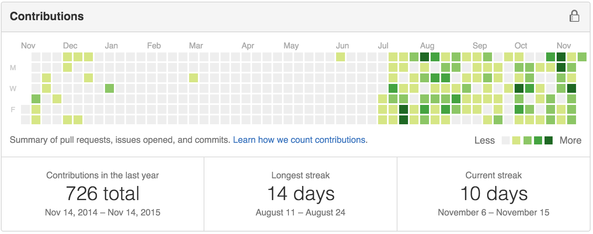

# colorful-github

GitHub contributions grid color changer for chrome and safari.

## before

## after

## Why not Safari?
* Finally, `colorful-github` supports Safari as extension.
* How to install?
	1. _Clone_ the repository.
	1. Launch `ColorfulGitHub.safariextz` file located in `safari` directory.
	1. Congratulations! You're done!